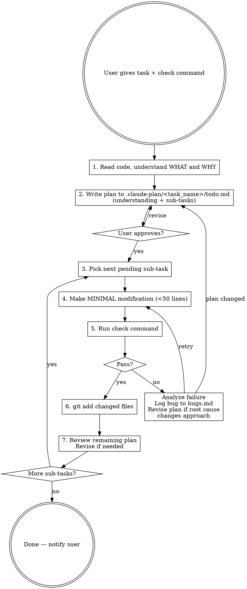

# Incremental Build

## Overview

Decompose a task into minimal sub-tasks. For each: make one small change, run the check command, `git add` **only when the explicit perf-metric gate passes**, then move on. Store and continuously revise the plan in `./.claude-plan/<task_name>/todo.md`.

## Hard Rule: gate-then-stage

**You MUST NOT `git add` until you can cite the measured metric value from the check output and confirm it meets the gate.** No exceptions.

- "Build succeeded" is not a gate. A gate is an inequality on a measurable quantity (accuracy ≥ 0.81, latency ≤ 100ms, tests passed = N/N, etc.).
- Before running a sub-task's check, state the expected gate (from the plan) explicitly — e.g. "gate: gsm8k exact_match ≥ 0.81".
- After the check, grep / parse the metric from the output and **quote it back** — e.g. "measured: gsm8k=0.8672 → PASS". Only then stage.
- If the metric is missing / unparseable / below the gate, treat it as FAIL. Log to bugs.md, do not stage, do not move on.
- If a sub-task is purely additive dead code (no runtime effect), the "gate" is still explicit: "build passes, file compiled, no link errors" — cite the compile line (e.g. `[N/N] Building CXX ... .o`). Editor / lint diagnostics without a build command run are NOT evidence.
- If no perf gate exists for the task, ask the user for one before starting (see Rule 8).

## Workflow



## Plan Storage

Each task gets its own **date-prefixed** folder under `.claude-plan/`:

```
.claude-plan/
  2026-03-26-bg-thread-multi-cpu-thread/
    plan.md        # high-level plan: current flow, target flow, diagram, task list
    todo.md        # remaining sub-tasks (detailed incremental plan)
    finished.md    # completed sub-tasks with dates, results, and verification
    bugs.md
```

**Naming:** `YYYY-MM-DD-<kebab-case-name>` — date is when the task was created.

**Three files:**
1. **`plan.md`** — high-level plan. Keep it concise: current flow, target flow, event/data diagram, one-line task list. No code, no implementation details. This is the "what and why" overview someone reads in 30 seconds.
2. **`todo.md`** — the living detailed plan: understanding, remaining sub-tasks, check command, revision log. When a sub-task passes verification, move it from `todo.md` to `finished.md`.
3. **`finished.md`** — completed sub-tasks with: date completed, files changed, what was done, verification result (accuracy, timing, etc.). This is the audit trail.

## Plan Format

### `todo.md` — remaining work

Store in `.claude-plan/YYYY-MM-DD-<task_name>/todo.md`:

```markdown
# Task: <one-line description>

## Understanding
<What is this task? What is the goal? What kind of change do I need to make? How these changes interact with the evaluation inference path? Can we split this task into smaller sub-tasks each sub task influence part of the final evaluation? Make the plan compact and easy to understand.(general thing compact, detailed thing detailed)>

## Check Command
`<command>`

## Gate (REQUIRED)
Explicit inequality on a measurable metric parsed from the check output.
Example: `gsm8k exact_match >= 0.81` (parse from `|gsm8k|...|exact_match|...|0.XXXX|`).
No gate = no staging. Ask the user before starting.

## Sub-tasks
Each sub-task should be a single modification group will give a small influence on the final evaluation.
Target < 100 lines changed per sub-task.( just try to make it, if not possible should be fine)

Each sub-task **must** state its own gate (usually inherits the task-level gate; purely additive sub-tasks can use "build passes: .o line present in cmake output"). After the check, quote the measured metric and only `git add` if it meets the gate.

## Revision Log
- <date/context>: revised step 3 because <reason>

## Bug Log: see bugs.md
```

### `finished.md` — completed work

Store in `.claude-plan/YYYY-MM-DD-<task_name>/finished.md`:

```markdown
# Finished: <task description>

**Date started:** YYYY-MM-DD
**Branch:** <branch name>

## 1. <sub-task name>
**Date:** YYYY-MM-DD
**Files:** <list of changed files>
<what was done>
**Verified:** YYYY-MM-DD, <result — accuracy, timing, etc.>

## 2. <sub-task name>
...
```

When a sub-task is verified, move it from `todo.md` to `finished.md` with the date and verification result.

## Rules

1. **Every sub-task must be a perf-eval-affecting change. Additive / plumbing is NOT a sub-task.** Decompose the user's task into the smallest possible changes that each shift the metric the given eval script measures. If a piece of work (new class, header, threaded-through param, dead function) can't plausibly move the eval metric, it is NOT its own sub-task — fold it into the next sub-task whose behavioral wiring DOES move the metric, and check them together. One eval run per sub-task, and the sub-task must deserve the run.

2. **Only run the eval script when perf can plausibly change.** "Can plausibly change" means: the runtime code path that the eval metric depends on was modified. Threading a param through with a default that keeps the old branch = no eval (just build + import + stage). Wiring a new branch into the hot path = eval. When in doubt, reason through whether the metric can numerically differ — if no, skip.

3. **Grow the tree — wire changes one group at a time.** Don't replace an entire function at once. Identify independent groups and wire them one at a time, running the eval after each perf-affecting wire. Verify each branch before growing the next.

4. **Check before staging behavioral changes.** Only run the check command when the inference path changes. Build+import only (no behavior change)? Just stage. Wired into forward()? Run check first.

5. **Cite the metric to stage.** Staging a perf-affecting sub-task requires quoting the measured metric from the check output and confirming it meets the gate. "Looks ok" / "no errors" is not enough. Format: `measured: <metric>=<value> → PASS (gate: <op> <threshold>)`. See "Hard Rule: gate-then-stage" above.

6. **`git add` only changed files** (not `git add -A`). Do NOT commit — just stage.

7. **On failure:** Read the error. Log to `.claude-plan/<task_name>/bugs.md`. Think deeply about root cause. If it invalidates later sub-tasks, revise the plan first. Fix minimally, for example, if this sub-task can be divided to multi-sub logic again, split it, re-run check for each sub sub task, find the minimal root cause, don't move on until green, can always rewrite the future plan.

8. **On sub-task completion:** Check off in `todo.md`, record result. Re-read remaining sub-tasks — revise if what you learned changes the approach.

9. **Write understanding first.** If you can't explain WHAT and WHY, you don't understand it well enough to split it.

10. **No check command / no gate?** Ask for both before starting. Acceptable: "run `pytest tests/foo.py`, gate = all pass"; "run eval script, gate = gsm8k ≥ 0.81"; "run `cargo bench`, gate = p50 latency ≤ 5ms". A check without a gate is a half-specified contract — refuse to proceed.

## Debugging with Parallel State

When a sub-task fails and the change touches a wide surface (many call sites, shared state, cross-cutting logic), **do not keep retrying the full change**. Instead, use the parallel-state technique to isolate the bug:

1. **Introduce the new path alongside the old one.** Don't replace — duplicate. Keep the old code running and producing results. Add the new code next to it, also producing results, but not yet wired into the output.

2. **Switch consumers one at a time.** Each sub-task switches ONE consumer from reading the old path to reading the new path. Run the check after each switch. The first switch that breaks pinpoints the bug.

3. **Compare outputs at the boundary.** If both paths exist, you can add assertions or logs that compare old vs new values. This catches semantic differences before they corrupt downstream results.

4. **Collapse once green.** After all consumers read from the new path and checks pass, remove the old path in a cleanup sub-task.

This technique is especially useful when:
- State is shared across many instances (e.g., per-layer vs global)
- The change affects multiple call sites that are hard to reason about together
- A big-bang replacement fails and the root cause isn't obvious

The key insight: **narrowing the blast radius per sub-task makes failures attributable**. If switching consumer X breaks the check, the bug is in how X uses the new state — not somewhere in the 200 lines you changed.

## Bug Log

On every failure, append to `.claude-plan/<task_name>/bugs.md`:

```markdown
### Bug #N — <sub-task name>
**Error:** <exact error message>
**Root cause:** <why it happened>
**Fix:** <what you changed>
**Plan impact:** <none / revised step X because ...>
```

## Starting a Task

1. **Understand.** Read relevant code. Understand WHAT and WHY. Write understanding in plan.
2. **Decompose by evaluation influence.** Each sub-task = one modification group that shifts part of the final result. Not "change lines 100-200" but "add helper that computes X" or "wire X into forward()".
3. **Order for safety.** Additive (new functions, imports) first. Behavioral (wiring, control flow) last.
4. **Show plan to user. Wait for approval.**
5. Begin the loop: pick → modify → check → stage → review.
